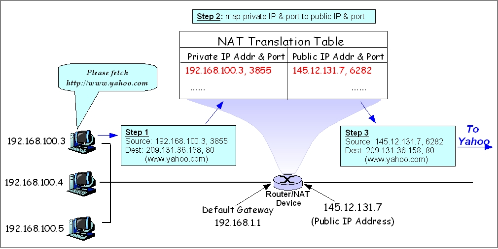

# NAT - Network Address Translation

NAT is a method of **remapping one IP address space into another** by **modifying** network address information in the **IP header** of packets while they are **in transit** accross a traffic routing device.

## One-to-Many NAT

NATs that map multiple private hosts to one exposed IP address. Usually, there is router between a locally private network and the internet. The router has a *local IP address* on the private network and also a *public IP address* to the internet provided by an *Internet Service Provider (ISP)*.

Outgoing packets from the private network to the internet are intercepted by the router which changes the source address information to its own public IP/Port. It them stores the information of the original source and also the destination in a NAT translation table in order to be able to forward response packets back to the original source.

## NAT Variations

- **Full Cone**: A full cone NAT is one where **all requests** from the same internal IP address and port are mapped to the **same external IP address and port**.  Furthermore, any external host can send a packet to the internal host, by sending a packet to the mapped external address.

- **Restricted Cone**: A restricted cone NAT is one where all requests from the same internal IP address and port are mapped to the same external IP address and port.  Unlike a full cone NAT, an external host (with IP address X) can send a packet to the internal host only if the internal host had previously sent a packet to IP address X.

- **Port Restricted Cone**: A port restricted cone NAT is like a restricted cone NAT, but the restriction includes port numbers. Specifically, an external host can send a packet, with source IP address X and source port P, to the internal host only if the internal host had previously sent a packet to IP address X and port P.

- **Symmetric**: A symmetric NAT is one where all requests from the same internal IP address and port, to a specific destination IP address and port, are mapped to the same external IP address and port. If the same host sends a packet with the same source address and port, but to a different destination, a different mapping is used. Furthermore, only the external host that receives a packet can send a UDP packet back to the internal host.

Source: [STUN - RFC](https://tools.ietf.org/html/rfc3489#page-5)

## Simple Traversal of User Datagram Protocol (UDP) Through NATs (STUN)

It allows applications to discover the presence and types of NATs and firewalls between them and the public Internet.  It also provides the ability for applications to determine the public Internet Protocol (IP) addresses allocated to them by the NAT. STUN works with many existing NATs, and does not require any special behavior from them. As a result, it allows a wide variety of applications to work through existing NAT infrastructure.

## Hole Punching

Hole punching is one of the most well-known methods of stablishing peer-to-peer communication between hosts on different private networks.

//TODO: Write down about UDP Hole Punching

## Sources

- [NAT - Wikipedia](https://en.wikipedia.org/wiki/Network_address_translation#Symmetric_NAT)
- [Peer-to-Peer Communication Across Network Address Translators (Ford et al.)](https://bford.info/pub/net/p2pnat/)
- [Simple Traversal of UDP Through NATs - RFC 3489](https://tools.ietf.org/html/rfc3489#page-5)
- [Traversal Using Relays around NAT (TURN) - RFC 5766](https://tools.ietf.org/html/rfc5766)
- [UDP Role Punching](https://en.wikipedia.org/wiki/UDP_hole_punching)